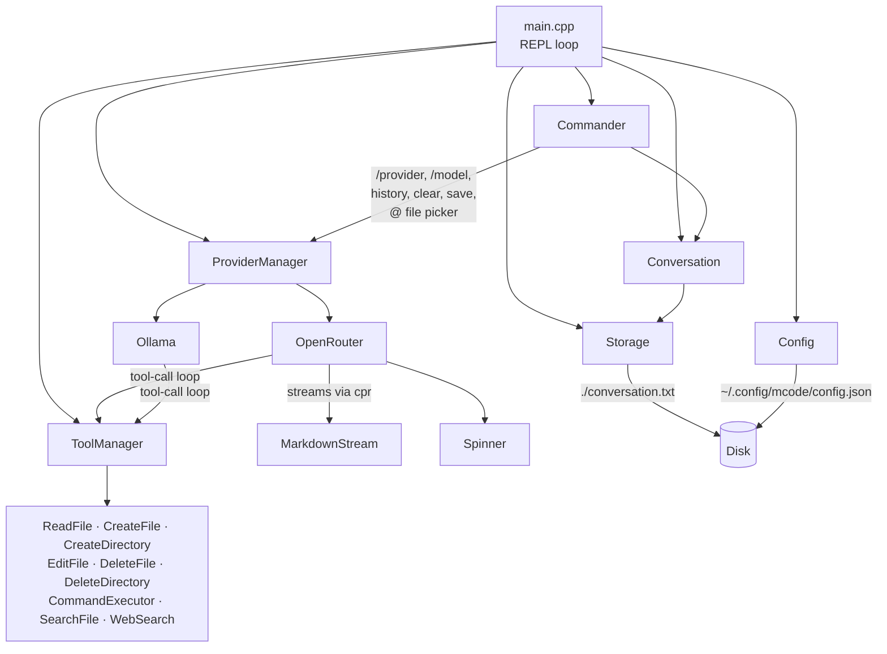

<div align="center">

# mcode

```
  __  __  ____ ___  ____  _____
 |  \/  |/ ___/ _ \|  _ \| ____|
 | |\/| | |  | | | | | | |  _|
 | |  | | |__| |_| | |_| | |___
 |_|  |_|\____\___/|____/|_____|
```

### A terminal-native coding agent, built from scratch in C++

*Streams tokens over your shell, edits your files, runs your commands — no Electron, no runtime, one native binary.*

[](https://en.cppreference.com/w/cpp/20)
[](https://cmake.org/)
[](#getting-started)
[](#configuration)
[](#roadmap)

</div>

---

## What is this

**mcode** is a small, self-contained terminal coding agent. Point it at a model — a cloud one through OpenRouter, or a local one through Ollama — and talk to it in a REPL. It can read and edit files in your project, run shell commands, search the filesystem, and fetch URLs, all gated behind your confirmation for anything destructive. Everything is a single native C++ binary with no language runtime, no bundled Node/Python, and no telemetry.

It's built to feel like a proper CLI tool: raw-mode line editing, in-place history recall, an inline file picker, and live Markdown rendering as the model streams its answer — not a REPL bolted onto a chat loop.

## Demo

```
  __  __  ____ ___  ____  _____
 |  \/  |/ ___/ _ \|  _ \| ____|
 | |\/| | |  | | | | | | |  _|
 | |  | | |__| |_| | |_| | |___
 |_|  |_|\____\___/|____/|_____|

A simplest terminal coding agent built using C++

> /provider
✓ Provider set: ollama
✓ Model set: qwen3:8b
> hey?
Hello! How can I assist you today?
>
```

## Features

### Done

- **Interactive REPL shell** — raw-terminal line editor (POSIX `termios`) with Up/Down prompt history recall, in-progress-draft preservation, and bracketed-paste support so multi-line pastes don't submit early.
- **Inline `@` file picker** — press `@` mid-prompt to pop a modal directory/file browser and splice the picked path straight into the line, instead of typing it out.
- **Ghost autocomplete** — an unambiguous prefix of a known command (`/prov` → `/provider`) is shown dimmed inline and expands on Enter.
- **Multi-provider model gateway** — swap between:
  - **OpenRouter** — cloud gateway routing to many hosted models, picked from a live-fetched, price-sorted model list.
  - **Ollama** — local models served from `http://localhost:11434`, no API key required.
  - Interactive pickers for both provider (`/provider`) and model (`/model`), plus a direct `/model <name>` form.
- **Streaming responses** with a live Markdown-to-ANSI renderer — headings, bold, inline code, and fenced code blocks render correctly as tokens arrive, chunk boundaries and all.
- **Braille spinner** with rotating status words (*Thinking, Pondering, Marinating, Scheming…*) while waiting on the first byte of a response.
- **Agentic tool-calling loop** — the model can chain up to 8 rounds of tool calls before answering, with each call's arguments streamed and merged before execution.
- **9 built-in tools**, all exposed to the model as JSON-Schema function defs:

  | Tool | What it does |
  |---|---|
  | `read_file` | Read a file's contents from disk |
  | `create_file` | Create a new file with given contents |
  | `create_directory` | Create a directory |
  | `edit_file` | Find/replace inside a file, with a colored `git diff --no-index` preview printed before writing |
  | `delete_file` | Delete a file — **asks for y/n confirmation first** |
  | `delete_directory` | Delete a directory recursively — **asks for y/n confirmation first** |
  | `command_executor` | Run a shell command and return stdout/stderr/exit code — **asks for y/n confirmation first** |
  | `search_file` | Recursive glob-pattern filename search |
  | `web_search` | Fetch a URL over HTTP(S) and return the (truncated) body |

- **Conversation persistence** — every turn is written to disk and reloaded automatically on the next launch, so a crash or plain `exit` never loses history.
- **Zero-config first run** — `~/.config/mcode/config.json` is created automatically on first launch if missing.

### Not done yet

See [Roadmap](#roadmap).

## Tech stack

| Layer | Choice |
|---|---|
| Language | C++20 (`-fcoroutines` enabled on GCC) |
| Build system | CMake ≥ 3.15 |
| HTTP client | [cpr](https://github.com/libcpr/cpr) (libcurl wrapper) — streaming request bodies for token-by-token output |
| JSON | [nlohmann/json](https://github.com/nlohmann/json) |
| Terminal I/O | Raw POSIX `termios`/`ioctl` — no ncurses, no external TUI library |
| Model gateways | [OpenRouter](https://openrouter.ai) (cloud, multi-model) · [Ollama](https://ollama.com) (local) |
| Diffing | Shells out to the system `git diff --no-index` for edit previews |

## Architecture



Each piece has one job and doesn't reach into the others' internals:

- `Provider` is an interface (`providers.h`) — `OpenRouter` and `Ollama` are interchangeable implementations, swapped at runtime by `ProviderManager` without touching `Commander` or `main`.
- `Tool` is likewise an interface (`tool.h`) — adding a new tool is a new subclass registered in `tool_initializer.cpp`; no provider code changes.
- `Commander` owns all terminal rendering (raw mode, pickers, ghost text) so `main.cpp` stays a plain loop.

## Getting started

### Quick install (macOS / Linux)

```bash
curl -fsSL https://raw.githubusercontent.com/MohakGupta2004/mcode/master/install.sh | bash
```

This installs missing build dependencies (`cmake`, a C++20 compiler, `nlohmann-json`, `cpr` — via Homebrew on macOS, or `apt`/`dnf`/`pacman`/`zypper` on Linux, building `cpr` from source if your distro doesn't package it), builds mcode, and drops the `mcode` binary into `/usr/local/bin` (falls back to `~/.local/bin` if that's not writable and there's no `sudo`).

Review [`install.sh`](install.sh) before piping it into `bash` — that's true of any curl-install script, this one included.

Then just run:

```bash
mcode
```

### Manual build

Prerequisites: CMake ≥ 3.15, a C++20 compiler, [`nlohmann-json`](https://github.com/nlohmann/json), [`cpr`](https://github.com/libcpr/cpr).

```bash
# macOS
brew install cmake nlohmann-json cpr

git clone https://github.com/MohakGupta2004/mcode.git
cd mcode
cmake -S . -B build
cmake --build build -j
```

This produces `build/mcode`. Run it with `./build/mcode`.

On first run mcode creates `~/.config/mcode/config.json` — see [Configuration](#configuration) before you try to use OpenRouter.

## Configuration

Config lives at `~/.config/mcode/config.json`, created automatically on first launch:

```json
{
    "API_KEY": {
        "openrouter": ""
    }
}
```

To use **OpenRouter**, drop your key into the `openrouter` field:

```json
{
    "API_KEY": {
        "openrouter": "sk-or-..."
    }
}
```

To use **Ollama**, no key is needed — just have `ollama serve` running locally on the default port (`11434`) and switch to it with `/provider`.

## Usage

| Command | Effect |
|---|---|
| *(plain text)* | Send a message to the current model |
| `@` (while typing) | Open the file/directory picker and insert the picked path |
| `↑` / `↓` | Recall previous prompts from this session |
| `/provider` | Open an interactive picker to switch between `openrouter` and `ollama` |
| `/model` | Open an interactive picker for the active provider's models |
| `/model <name>` | Set the model directly, no picker |
| `history` | Print the full conversation so far |
| `clear` | Clear in-memory conversation history |
| `save` | Force-persist the conversation to disk |
| `exit` / `Ctrl-D` | Quit |

## Roadmap

Known gaps and unfinished corners, roughly in priority order:

- [ ] **`web_search` is a raw URL fetch, not a search engine** — it fetches a given URL's body; it doesn't query anything. A real search API integration is still open.
- [ ] **No automated tests or CI.**
- [ ] **No packaging** — no Homebrew formula, no prebuilt releases; build-from-source only.
- [ ] **No license file** — pick and add one before treating this as distributable.
- [ ] **Windows is unsupported** — terminal handling is POSIX-only (`termios`, `unistd.h`, `sys/ioctl.h`).
- [ ] **System prompt is hardcoded** in the OpenRouter provider, not user-configurable.
- [ ] **No non-interactive mode** — no way to pipe a single prompt in and get one answer out for scripting; the REPL assumes an interactive TTY.
- [ ] **Ollama support is newer/less exercised** than OpenRouter — expect rough edges.

## Contributing

This is a solo learning/build project in active development — expect breaking changes. Issues and PRs against [the repo](https://github.com/MohakGupta2004/mcode) are welcome.